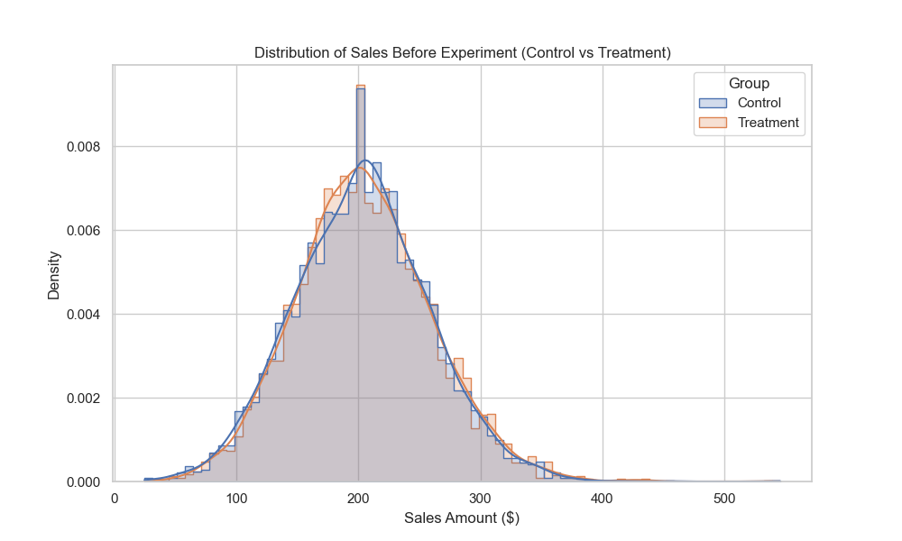
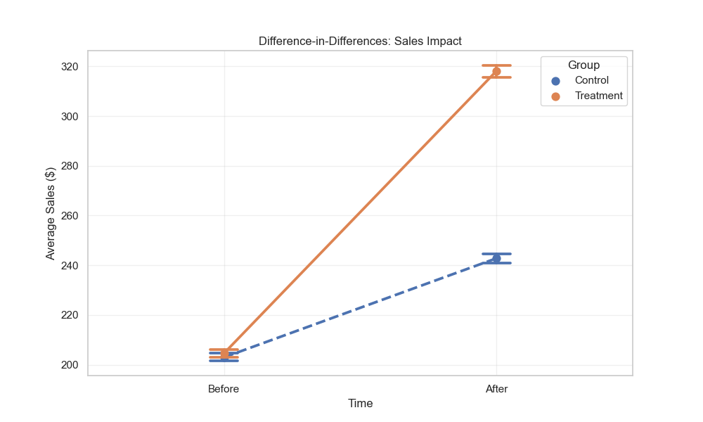
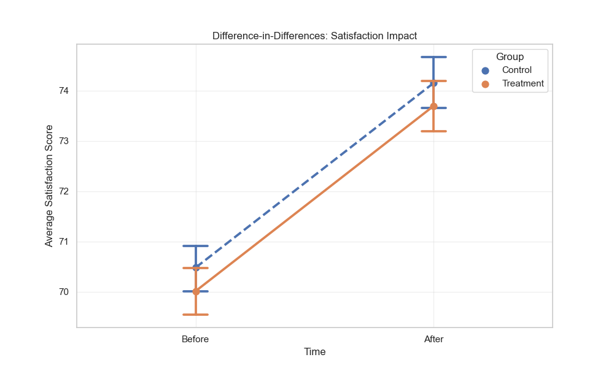

# Store Strategy Experimentation  
### A Controlled A/B Test with Difference-in-Differences Analysis

---
## Table of Contents

- [Business Objective](#1-business-objective)
- [Problem Framing](#2-problem-framing)
- [Analytical Approach](#3-analytical-approach)
- [Experiment Validation & Readiness](#4-experiment-validation--readiness)
- [Revenue Impact Analysis (Sales)](#5-revenue-impact-analysis-sales)
- [Customer Satisfaction Impact](#6-customer-satisfaction-impact)
- [Visual Validation](#7-visual-validation)
- [Key Findings](#8-key-findings)
- [Management Decision](#9-management-decision)
- [Business Impact (Illustrative)](#10-business-impact-illustrative)
- [Limitations & Next Steps](#11-limitations--next-steps)

---

## 1. Business Objective
Evaluate whether a newly introduced store strategy drives incremental
sales growth without negatively impacting customer satisfaction, using
a controlled experiment.

---

## 2. Problem Framing
Before rolling out the new strategy at scale, management requires **causal evidence** of its effectiveness. 
Simple observational comparisons are insufficient due to potential baseline differences between stores or customers.

A randomised Control vs Treatment experiment was therefore designed to enable robust causal inference.

---

## 3. Analytical Approach
The analysis follows a structured experimental framework:

- Randomised Control vs Treatment design
- Sanity checks for experiment validity:
  - Sample Ratio Mismatch (SRM)
  - Pre-experiment balance tests
  - Statistical power and minimum detectable effect (MDE)
- Post-experiment comparison of key outcomes
- Difference-in-Differences (DID) estimation for causal impact
- Visual validation using interaction plots

---

## 4. Experiment Validation & Readiness

### 4.1 Randomisation & Balance Checks
Control (5,013) and Treatment (4,987) groups are well balanced, with no evidence of sample ratio mismatch.

Pre-experiment sales and customer satisfaction metrics show no statistically significant differences between groups, confirming comparability prior to intervention (*p-value = 0.1375*).

### Table 1: Pre-Experiment Means

| Metric                         | Control    | Treatment  | Difference (Control − Treatment) |
|--------------------------------|------------|------------|----------------------------------|
| Sales Before ($)               | 203.03     | 204.67     | -1.65                            |
| Customer Satisfaction Before   | 70.48      | 70.02      | 0.47                             |

### 4.2 Power Analysis
The experiment is sufficiently powered to detect a minimum sales difference of **$3.11 per customer** at 80% power, ensuring sensitivity to economically meaningful effects.

**Conclusion:**  
The experimental design is statistically robust and suitable for causal decision-making (see Figure 1).

  
   
  <em>Figure 1: Distribution Sales Before Experiment (Treatment vs. Control)</em>

---

## 5. Revenue Impact Analysis (Sales)

### 5.1 Post-Experiment Comparison
- Average Sales (Control): **$242.83**
- Average Sales (Treatment): **$318.13**
- Simple uplift: **+31.0%** (p < 0.001)

### 5.2 Causal Impact (Difference-in-Differences)
Using a DID framework to control for baseline effects:

- Incremental sales uplift: **+$73.65 per customer**
- Statistical significance: **p < 0.001**

**Conclusion:**  
The new store strategy delivers a statistically significant and economically material increase in revenue, with strong causal evidence.

---

## 6. Customer Satisfaction Impact

A Difference-in-Differences analysis was also applied to customer satisfaction scores to assess potential trade-offs between revenue and customer experience.

- Average Satisfaction (Control): **74.15**
- Average satisfaction (Treatment): **73.69**
- Net DID effect: **+0.01 points**
- Statistical significance: **Not significant (p = 0.96)**

**Conclusion:**  
Revenue gains are achieved **without compromising customer satisfaction**.

---

## 7. Visual Validation

Difference-in-Differences interaction plots were used to visualise pre- and post-experiment trends:

- Sales trends diverge clearly after intervention, with Treatment outperforming Control (see Figure 2)

  
   
  <em>Figure 2: Difference-in-Differences: Sales Impact</em>

- Satisfaction trends remain parallel across groups (See Figure 3)

  
   
  <em>Figure 3: Difference-in-Differences: satisfaction Impact</em>

These visual patterns reinforce the statistical findings and support the parallel trends assumption.

---

## 8. Key Findings
- The experiment is well-randomised, balanced, and statistically sound
- The store strategy generates a **causal sales uplift of $73.65 per customer**
- No negative impact on customer satisfaction is observed
- Results are both statistically significant and commercially relevant

---

## 9. Management Decision
Based on strong causal evidence, we recommend rolling out the new store strategy to similar store formats. The expected revenue uplift outweighs implementation risk, with no adverse impact on customer experience.

---

## 10. Business Impact (Illustrative)
Assuming 100 customers per store per day, the estimated incremental revenue is approximately **$7,365 per store per day**, equivalent to **~$2.7M annually per store**.

---

## 11. Limitations & Next Steps
- The experiment captures short-term effects only
- Results may vary across store size, region, or customer segments

**Next steps:**
- Segment-level DID analysis (e.g. store type, geography)
- Longer observation window to assess sustainability
- Follow-up experiments to optimise specific strategy components

---

## 12. Tools & Methods
- Python (pandas, scipy, statsmodels)
- Statistical hypothesis testing
- Difference-in-Differences methodology
- Data visualisation with seaborn & matplotlib
